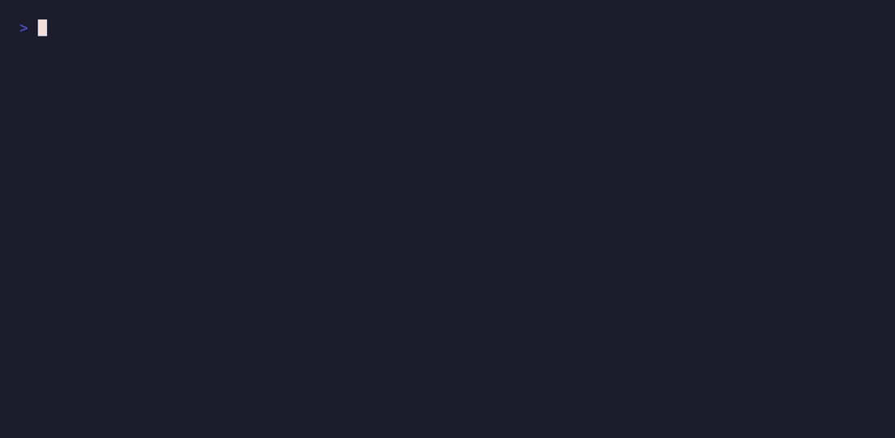

# meshStack CLI

`meshstack` is the command line interface for [meshStack](https://www.meshcloud.io/). This
repository also holds the Go client for the meshStack API, which the
[meshStack Terraform provider](https://github.com/meshcloud/terraform-provider-meshstack) imports.



## Install

### With [Homebrew](https://brew.sh/)

```shell
brew install meshcloud/tap/meshstack-cli
brew upgrade meshstack-cli
```

### With Go

```shell
go install github.com/meshcloud/meshstack-cli/cmd/meshstack@latest
```

...or without installing it:

```shell
go run github.com/meshcloud/meshstack-cli/cmd/meshstack@latest --version
```

### With [Nix](https://nixos.org/) (flakes enabled)

```shell
nix profile add github:meshcloud/meshstack-cli   # older Nix: `nix profile install`
nix profile upgrade meshstack-cli
```

...or without installing it:

```shell
nix run github:meshcloud/meshstack-cli -- --version
```

:warning: `nix profile upgrade` follows the `main` branch, not releases.

### With the install script

```shell
curl -fsSL https://raw.githubusercontent.com/meshcloud/meshstack-cli/main/install.sh | sh
```

## Development

The Nix dev shell provides Go, `goreleaser` and `task`:

```shell
nix develop
task build            # writes ./meshstack
task test
task lint             # add -- --fix to apply the fixes it can make itself
task release:snapshot # the release artifacts, into dist/, without publishing them
```
